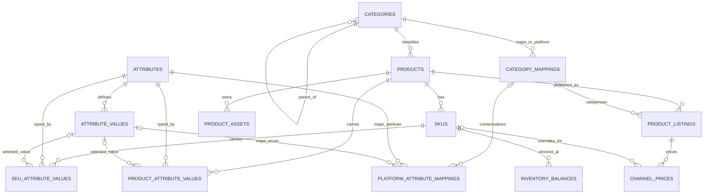

# AIONE 商品域数据库 Schema V1 草案

Status: DRAFT / CANDIDATE（候选，未批准为 CURRENT）  
Draft date: 2026-09-01  
Applies to: 美和AIONE一体化工作平台（AIONE）商品域  
Target repository path: `docs/architecture/AIONE_PRODUCT_DOMAIN_DATABASE_SCHEMA_V1_DRAFT.md`

> 本文是供 Product Freeze、Technical Design 与后端评审使用的数据库 Schema V1 候选，不是迁移文件，不代表数据库、API、页面、Rakuten CSV 或 API 同步已经实现。任何实现、上线或 CURRENT 状态都需要独立开发、测试、验收与治理批准。

## 1. 目的与架构边界

本草案将已收口的商品域最小闭环整理为 14 组 CORE 表/能力，支撑：

```text
分类 → 商品 → SKU → 属性 → 价格 → 库存 → 资料
     → 平台分类/属性映射 → Listing → CSV/API Adapter → 同步状态
```

核心原则：

- AIONE 内部对象身份独立于 Rakuten 或其他平台字段。
- 同一个 Product、SKU、Category 在不同渠道通过 Mapping、Listing 和 Adapter 投影，不复制内部对象。
- 平台的 576 列等外部 Contract 不得反向演变为 `products` 巨型表。
- Listing 与 Product 严格分离；平台商品管理番号、URL、状态属于 Listing。
- 价格保留历史，不原地覆盖历史事实。
- V1 库存只定义当前余额；库存流水、批次、成本层延后。
- 商品属性支持枚举、文本、布尔、日期、数值与单位；SKU 值可覆盖商品级默认值。
- AIONE 标准属性值与平台枚举值严格分离。
- CSV 与 API 是 Transport Adapter，不是商品域 Source of Truth。

## 2. 通用约定

除特别说明外，候选表使用以下约定：

- 主键：`id uuid`，由 AIONE 生成，不使用平台 ID 作为 PK。
- 时间：`created_at timestamptz not null`、`updated_at timestamptz not null`。
- 乐观并发：建议 `version bigint not null default 1`。
- 业务代码：使用稳定机器代码，显示名称与多语言标签不得作为关系键。
- 金额：使用定点小数或最小货币单位；禁止浮点数。
- 状态：使用稳定枚举代码，不存中文、日文或英文显示标签。
- 软废止：主数据优先使用 `status`、`is_active`、`deprecated_at`；事实与历史记录通常只追加或失效，不物理删除。
- 审计：正式实现时所有写入应接入统一身份、审计日志和请求关联 ID；本文不另建页面级审计表。
- 多租户：若 AIONE 部署为共享数据库，所有唯一约束须增加 `tenant_id` 前缀；租户模型未冻结前，本文省略该列但不得默认系统永远单租户。

## 3. CORE 表定义

字段只列 V1 关系与治理所需的最小候选集；DDL、数据库类型细节、枚举值和迁移顺序仍需 Technical Design 冻结。

### 3.1 `categories`

用途：AIONE 商品分类主数据。

- PK：`id`
- FK：`parent_id → categories.id`，可空；根分类为空
- 关键字段：`code`、`name`、`level`、`status`、`sort_order`、`deprecated_at`
- 唯一约束：`unique(code)`；同一父节点下建议 `unique(parent_id, name)`
- 基数：父 Category `1 → 0..N` 子 Category；Category `1 → 0..N` Products
- Source of Truth / 写入责任：AIONE 分类中心；平台 Adapter 只读
- 删除策略：未被引用且未同步的误建记录才允许受控物理删除；已被 Product 或 Mapping 使用的分类只能停用/废止

### 3.2 `products`

用途：跨渠道稳定的商品（SPU/款）身份与商品级默认信息。

- PK：`id`
- FK：`category_id → categories.id`
- 关键字段：`product_code`、`name`、`brand_code`、`status`、`category_id`
- 唯一约束：`unique(product_code)`
- 基数：Category `1 → 0..N` Products；Product `1 → 1..N` SKUs（允许创建期暂为 0）；Product `1 → 0..N` Listings / Assets / Attribute Values
- Source of Truth / 写入责任：AIONE 商品中心
- 删除策略：一旦有关联 SKU、Listing、价格、同步或业务记录，不物理删除；走停用/废止
- 边界：`genreId`、平台商品管理番号、平台 URL、平台说明文不得成为 Product 身份字段

### 3.3 `skus`

用途：可定价、可库存、可交易的具体规格身份。

- PK：`id`
- FK：`product_id → products.id`
- 关键字段：`sku_code`、`barcode`、`status`、`product_id`
- 唯一约束：`unique(sku_code)`；非空条码建议 `unique(barcode)`
- 基数：Product `1 → 0..N` SKUs；SKU `1 → 0..N` SKU Attribute Values / Channel Prices / Inventory Balances
- Source of Truth / 写入责任：AIONE 商品/SKU 中心
- 删除策略：进入库存、Listing 或订单链路后仅停用；禁止因平台 SKU 编号变化而重建内部身份

### 3.4 `attributes`

用途：统一属性定义，不按页面或平台重复建字段。

- PK：`id`
- FK：无 CORE 必需 FK
- 关键字段：`code`、`name`、`scope`（PRODUCT / SKU / BOTH）、`data_type`（ENUM / TEXT / NUMBER / BOOLEAN / DATE）、`unit_policy`、`is_required`、`status`
- 唯一约束：`unique(code)`
- 基数：Attribute `1 → 0..N` Attribute Values；Attribute `1 → 0..N` Product/SKU Attribute Values；Attribute `1 → 0..N` Platform Attribute Mappings
- Source of Truth / 写入责任：AIONE 属性中心
- 删除策略：被使用后只能废止；`data_type` 等破坏兼容性的修改必须迁移或新建属性版本

### 3.5 `attribute_values`

用途：AIONE 标准枚举值；不保存 Rakuten 等平台枚举代码。

- PK：`id`
- FK：`attribute_id → attributes.id`
- 关键字段：`code`、`label`、`sort_order`、`status`
- 唯一约束：`unique(attribute_id, code)`
- 基数：Attribute `1 → 0..N` Values；Value `1 → 0..N` 业务赋值与平台值映射
- Source of Truth / 写入责任：AIONE 属性中心
- 删除策略：被引用后只能废止；平台枚举变化只修改 Mapping，不改 AIONE 标准值身份

### 3.6 `product_attribute_values`

用途：商品级属性值与 SKU 默认值。

- PK：`id`
- FK：`product_id → products.id`、`attribute_id → attributes.id`、`attribute_value_id → attribute_values.id`（仅 ENUM，可空）
- 关键字段：`text_value`、`number_value`、`boolean_value`、`date_value`、`unit_code`
- 唯一约束：`unique(product_id, attribute_id)`
- 校验约束：按 `attributes.data_type` 只允许一个对应值列非空；ENUM 值必须属于同一 `attribute_id`；单位必须符合 `unit_policy`
- 基数：Product / Attribute 各 `1 → 0..N` Product Attribute Values
- Source of Truth / 写入责任：AIONE 商品中心，通过属性服务校验
- 删除策略：允许受审计的更正；关键变更应保留审计/历史。SKU 同属性有值时，以 SKU 值覆盖 Product 默认值，但不修改 Product 值

### 3.7 `sku_attribute_values`

用途：SKU 级差异属性，例如颜色、尺寸、代表颜色、图案。

- PK：`id`
- FK：`sku_id → skus.id`、`attribute_id → attributes.id`、`attribute_value_id → attribute_values.id`（仅 ENUM，可空）
- 关键字段与校验：同 `product_attribute_values`
- 唯一约束：`unique(sku_id, attribute_id)`
- 基数：SKU / Attribute 各 `1 → 0..N` SKU Attribute Values
- Source of Truth / 写入责任：AIONE SKU 中心，通过属性服务校验
- 删除策略：允许受审计更正；删除覆盖值后回退到 Product 默认值，Adapter 必须显式执行解析规则

### 3.8 `category_mappings`

用途：AIONE 分类到外部平台分类/Genre 的上下文映射。

- PK：`id`
- FK：`category_id → categories.id`
- 关键字段：`platform_code`、`account_key`、`market_code`、`external_category_id`、`external_category_path`、`mapping_status`、`effective_from`、`effective_to`
- 唯一约束：活动期建议 `unique(platform_code, account_key, market_code, category_id)`；外部目标去重建议 `unique(platform_code, account_key, market_code, external_category_id, category_id)`
- 基数：Category `1 → 0..N` Category Mappings；一个平台分类也可由多个 AIONE 分类按条件映射
- Source of Truth / 写入责任：AIONE 分类/渠道映射管理；平台元数据是校验依据，不是内部分类主数据
- 删除策略：已用于 Listing 或同步后只失效；保留有效期和历史
- 边界：条件映射可依赖商品属性，但规则应由映射/规则层表达，不把平台 Genre ID 写入 `products`

### 3.9 `platform_attribute_mappings`

用途：AIONE 属性/标准枚举到平台属性 ID、字段名和枚举代码的映射。

- PK：`id`
- FK：`attribute_id → attributes.id`、`attribute_value_id → attribute_values.id`（可空，表示属性级映射）、`category_mapping_id → category_mappings.id`（可空，表示全局映射）
- 关键字段：`platform_code`、`platform_attribute_code`、`platform_value_code`、`mapping_status`、`transform_rule_ref`、`effective_from`、`effective_to`
- 唯一约束：按平台、分类上下文、内部属性和值形成唯一活动映射；同一上下文的外部值不可产生歧义
- 基数：Attribute/Value/Category Mapping 各 `1 → 0..N` Platform Attribute Mappings
- Source of Truth / 写入责任：AIONE 渠道映射管理；Adapter 只消费已批准映射
- 删除策略：同步使用后只失效；保留历史
- 边界：`ブラック`、`綿・コットン` 等平台枚举只存在于此映射或 Adapter Contract，不替换 AIONE 的 `black`、`cotton` 等标准值

### 3.10 `product_listings`

用途：Product 在具体平台、账号、市场中的上架投影与生命周期。

- PK：`id`
- FK：`product_id → products.id`、`category_mapping_id → category_mappings.id`（可空，发布前可未解析）
- 关键字段：`platform_code`、`account_key`、`market_code`、`external_listing_id`、`listing_key`、`listing_status`、`published_at`
- 唯一约束：`unique(platform_code, account_key, market_code, listing_key)`；非空外部 ID 同范围唯一；建议 `unique(product_id, platform_code, account_key, market_code)`，若业务确认一品多 Listing 再显式放宽
- 基数：Product `1 → 0..N` Listings；Listing `1 → 0..N` Channel Prices / Sync States
- Source of Truth / 写入责任：AIONE 管理发布意图与内部状态；平台回执更新外部 ID 和已观测状态
- 删除策略：发布后不得物理删除；关闭/归档并保留同步历史
- 边界：商品管理番号（商品 URL）、平台状态、平台文案/内容版本属于 Listing/P1 内容能力，不属于 Product 身份

### 3.11 `channel_prices`

用途：渠道/Listing 价格的有效期历史，支持 Product 级默认或 SKU 级覆盖。

- PK：`id`
- FK：`product_listing_id → product_listings.id`、`sku_id → skus.id`（可空，空表示 Listing 默认价）
- 关键字段：`price_type`、`amount`、`currency_code`、`valid_from`、`valid_to`、`status`
- 唯一约束：候选 `unique(product_listing_id, sku_id, price_type, valid_from)`；同一作用域有效期不得重叠（数据库 exclusion constraint 或服务层事务校验，待技术选型）
- 基数：Listing `1 → 0..N` Prices；SKU `1 → 0..N` Channel Prices
- Source of Truth / 写入责任：AIONE 定价能力；平台回读价格只作为差异校验/观测值，除非批准导入
- 删除策略：不覆盖历史；以新记录和有效期替代，错误记录作废并保留审计

### 3.12 `inventory_balances`

用途：V1 当前库存余额，不替代未来库存流水。

- PK：`id`
- FK：`sku_id → skus.id`
- 关键字段：`location_code`、`on_hand_qty`、`reserved_qty`、`available_qty`、`as_of_at`、`source_system_code`
- 唯一约束：`unique(sku_id, location_code)`
- 校验约束：数量精度与是否允许负库存由库存规则冻结；`available_qty` 应由确定性公式计算或在事务中一致维护
- 基数：SKU `1 → 0..N` Inventory Balances
- Source of Truth / 写入责任：指定库存系统/库存服务；Listing 与 Adapter 只读可售量
- 删除策略：不因 SKU 停用删除余额；关停库位后归零并归档。流水、批次、调拨、盘点证据不在 V1 CORE

### 3.13 `product_assets`

用途：Product 级图片/文件与其业务角色；文件本体由统一文件/对象存储能力管理。

- PK：`id`
- FK：`product_id → products.id`
- 关键字段：`asset_ref`、`asset_type`、`role_code`、`sort_order`、`alt_text`、`status`
- 唯一约束：建议 `unique(product_id, asset_ref, role_code)`；同一 Product 仅一个活动主图可用条件唯一约束
- 基数：Product `1 → 0..N` Assets
- Source of Truth / 写入责任：AIONE 商品资料管理；Adapter 按平台规则选择、排序和转换
- 删除策略：被发布/同步引用后先解除业务关联并归档；底层文件物理删除由统一文件保留策略决定
- 边界：SKU 专属图属于 P1 `sku_assets`，不可用 Product Asset 临时字段长期混用

### 3.14 `external_sync_states`

用途：记录 AIONE 对象到外部目标的最近同步状态、版本、摘要和错误，不承载商品主数据。

- PK：`id`
- FK：V1 采用受控软引用 `resource_type + resource_id`，不声明跨多表物理 FK；允许的类型必须白名单化。若后续仅服务 Listing，应迁移为明确 `product_listing_id` FK
- 关键字段：`resource_type`、`resource_id`、`platform_code`、`account_key`、`transport_type`（CSV / API）、`direction`、`sync_status`、`source_version`、`payload_hash`、`external_version`、`last_attempt_at`、`last_succeeded_at`、`error_code`、`error_summary`、`correlation_id`
- 唯一约束：`unique(resource_type, resource_id, platform_code, account_key, transport_type, direction)`
- 基数：受控业务对象 `1 → 0..N` Sync States
- Source of Truth / 写入责任：统一 Integration Service / Adapter 执行器
- 删除策略：当前状态可更新，尝试明细与完整错误应进入统一集成日志/审计；不得级联删除以掩盖历史失败
- 边界：这里存状态、版本和摘要，不复制完整 576 列 payload，不存密钥，不成为平台数据镜像表

## 4. ER 关系说明



`external_sync_states` 以受控软引用连接允许同步的 Product、SKU、Listing 或 Mapping。由于 Mermaid 无法表达白名单多态引用，图中不画伪 FK。

## 5. 关键基数与解析规则

- 一个 Category 可有多个子分类和 Products；一个 Product 在 V1 只有一个内部主分类。
- 一个 Product 可有多个 SKUs、Listings、Assets 和商品属性值。
- 一个 SKU 必须属于一个 Product；SKU 属性覆盖同属性的 Product 默认值。
- 一个 Attribute 可定义多个标准枚举值；非枚举类型不使用 `attribute_values`。
- 一个内部分类/属性可按平台、账号、市场、Genre 上下文拥有多个历史映射，但同一活动上下文不得歧义。
- 一个 Product 可跨多个平台/账号/市场产生 Listings；默认同一作用域一个 Listing，放宽前必须有真实业务证据。
- 一个 Listing 可有多条价格历史；SKU 价优先于 Listing 默认价。
- 一个 SKU 可按库位有多个余额，但每个 SKU/库位只有一个当前余额。

## 6. Source of Truth 与写入责任

| 数据 | Source of Truth | 允许写入者 | 平台回读用途 |
|---|---|---|---|
| 分类、商品、SKU 身份 | AIONE | 分类/商品/SKU 服务 | 差异检测，不改内部身份 |
| 属性定义与标准值 | AIONE 属性中心 | 属性服务 | 校验平台 Contract |
| 分类/属性平台映射 | AIONE 映射管理 | 映射服务/受控管理员 | 校验、版本更新候选 |
| Listing 发布意图 | AIONE | 上架服务 | 回写外部 ID、已观测状态 |
| 渠道价格 | AIONE 定价能力 | 定价服务 | 差异检测；导入需批准 |
| 库存余额 | 指定库存系统 | 库存服务 | 差异/同步回执，不直接覆盖 |
| 商品资料关联 | AIONE 资料管理 | 文件/商品资料服务 | 平台 URL 仅作投影/回执 |
| 同步状态 | AIONE Integration Service | Adapter 执行器 | 平台回执是状态输入 |

任何 CSV 手工修改或平台后台修改都不自动升级为 AIONE 正式事实。需要 Import/Conflict Review 流程明确接受后，才由对应领域服务写入。

## 7. 平台字段边界

必须保留在 AIONE CORE 的是稳定业务语义，例如 Product、SKU、内部分类、标准属性、价格、库存与资料引用。

应留在 Mapping / Listing / Adapter Contract 的是平台特有字段，例如：

- Rakuten `ジャンルID`
- 商品管理番号（商品 URL）与系统联携用 SKU 编号
- 平台属性 ID、日文枚举、缺失理由、平台固定值
- PC / 手机说明列、图片 1–20 列、平台配送/合规列
- CSV 列名、列顺序、CP932 编码、空值表达和 API request/response schema

禁止：

- 因平台新增列而直接向 `products` / `skus` 加同名字段。
- 用平台 ID 替代 AIONE UUID 或业务代码。
- 将平台日文枚举直接写进 `attribute_values` 作为内部标准。
- 让 React 页面、路由 Handler 或一次性脚本拥有第二套映射逻辑。

如某个平台字段被证明具有跨渠道、稳定的业务语义，应先完成 Product Freeze / Object Model 评审，再决定是否提升为领域字段。

## 8. CSV / API Adapter 边界

统一流程：

```text
AIONE Domain Snapshot
→ Mapping Resolution
→ Platform Contract Projection
→ Validation
→ CSV Encoder 或 API Client
→ Transport
→ Receipt / Error Normalization
→ external_sync_states + Integration/Audit Log
```

Adapter 负责：

- 读取已批准的内部对象快照与 Mapping。
- 将内部代码/枚举/单位转换为平台字段和值。
- 执行平台必填、长度、枚举、Genre 条件和跨字段校验。
- CSV 的列顺序、CP932 等编码、转义、文件切分与批次清单。
- API 的认证适配、请求/响应转换、幂等键、分页、限流、重试与错误归一化。
- 产生可追踪的 payload hash、source version、correlation ID 和同步结果。

Adapter 不负责：

- 创建第二套 Product、SKU、Category 或 Attribute 身份。
- 直接修改领域表以迁就单个平台。
- 把 CSV/API payload 当作永久主数据或完整镜像。
- 保存密钥到 Schema 或文档；密钥进入统一 Secret 管理。
- 在 API Handler、页面或临时脚本中绕过领域服务写库。

CSV 与 API 必须共享同一个 Platform Contract / Mapping 解析层，只替换 Transport；两条链路不得各维护一套业务规则。CSV 导入还需经过解析、校验、差异预览、人工确认和领域服务写入，不能直接 bulk upsert CORE 表。

## 9. 删除、废止与历史总则

- 主数据（Category、Product、SKU、Attribute、Attribute Value）一经业务使用，采用停用/废止。
- Mapping 与 Price 使用有效期和状态保留历史。
- Listing 发布后关闭/归档，不因平台删除而删除内部 Product。
- Inventory Balance 是当前投影；历史证据由 Later 的 Ledger/Movement 模型承担。
- Asset 先解除关联并按统一保留策略处理文件。
- Sync State 与集成日志不得通过级联删除隐藏失败或外部操作证据。
- 物理删除只能用于未被引用、未发布、未同步的误建数据，并需要权限与审计。

## 10. 范围分层

### V1 CORE（本草案）

`categories`、`products`、`skus`、`attributes`、`attribute_values`、`product_attribute_values`、`sku_attribute_values`、`category_mappings`、`platform_attribute_mappings`、`product_listings`、`channel_prices`、`inventory_balances`、`product_assets`、`external_sync_states`。

目标闭环优先验证女袜、男袜、女帽、男帽：内部分类和属性 → SKU → 价格/库存/图片 → Rakuten 映射 → CSV/API Adapter → 上架校验与同步状态。

### P1（V1 第二阶段，不阻塞 CORE）

- `listing_contents`：渠道/语言/版本化标题、说明和销售文案。
- `sku_assets`：SKU 专属图片与资料角色。
- `fulfillment_rules`：纳期、配送和履约规则。
- `platform_compliance_values`：Catalog ID 缺失理由等平台合规值。

### LATER（明确延后）

- `product_variant_definitions`：在真实复杂 Variant 需求出现前，先由 SKU 属性推导。
- `listing_options`：评论特典、促销选项等运营策略不得过早耦合商品核心模型。
- 库存流水/批次/调拨/盘点、复杂价格规则、完整同步尝试日志等，需独立 Product Freeze 与 Technical Design。

## 11. 实施前必须冻结的决策

本文不授权直接创建数据库。实施前至少还要锁定：

1. 数据库引擎、UUID/时间/金额/数量类型与命名规范。
2. 租户、组织、渠道账号、市场、库位的正式对象与 FK。
3. 状态枚举、属性 `data_type` 校验和单位注册表。
4. 一个 Product 在同一渠道作用域是否允许多个 Listings。
5. 价格有效期不重叠的数据库实现。
6. `external_sync_states` 多态软引用是否保留，或收窄为明确 FK。
7. 审计、权限、幂等、批处理、错误模型和数据保留策略。
8. Rakuten Mapping Contract 的版本、真实 CSV/API 样例与验收用例。
9. 迁移、Repository/Data Access、Service、API Contract 与测试计划。

## 12. 候选验收标准

本草案只有在以下证据通过后，才可进入批准或实现阶段：

- 14 组 CORE 对象的字段、PK/FK、唯一约束与责任人完成评审。
- 男/女袜与男/女帽真实商品可以在不添加平台专属 CORE 字段的前提下表达。
- Rakuten Genre、属性枚举、SKU、价格、库存、图片可由统一 Mapping 投影。
- 同一 Domain Snapshot 可分别生成 CSV 与 API 请求，且业务结果一致。
- Product/SKU/Category 身份不随平台字段改变。
- 删除/废止、历史价格、同步失败和重试都有可审计路径。
- DDL、迁移、Contract、测试与回滚计划另行提交并通过 Review。

## 13. 治理状态

本文当前仅为 **AIONE 商品域数据库 Schema V1 草案/候选**。

- 不是 CURRENT Schema。
- 不是 Product Freeze 已批准结论。
- 不是数据库迁移或可执行 DDL。
- 不代表 14 组表已创建。
- 不代表 Rakuten CSV/API Adapter 已实现。
- 不得据此宣称功能已上线、已验收或 main 已具备该能力。

批准后应通过新的状态变更或 ADR 记录正式决策；被替代后进入 Deprecated 管理，不保留两套互相冲突的 CURRENT 定义。

